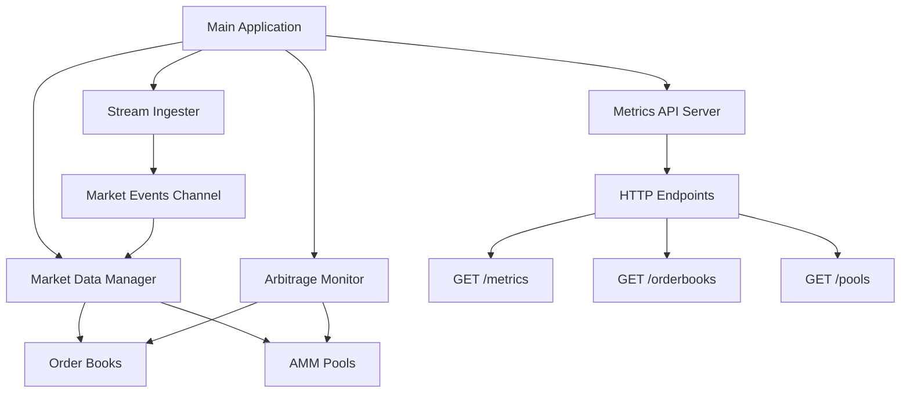
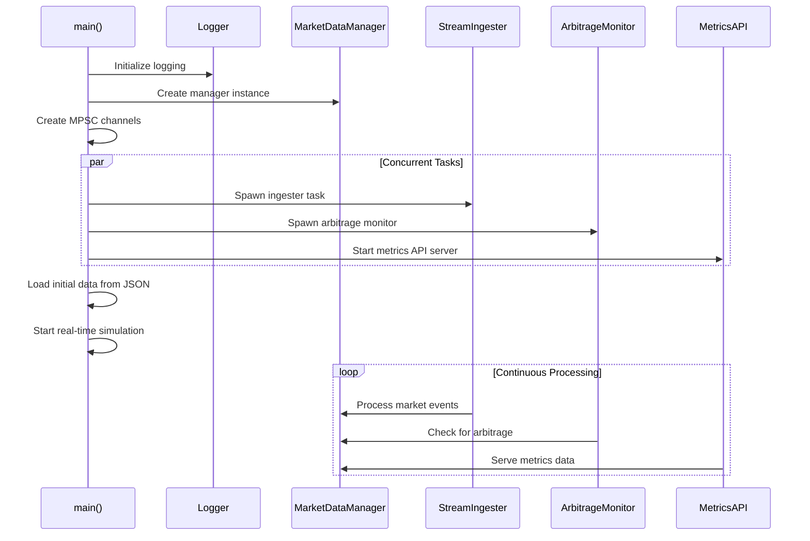
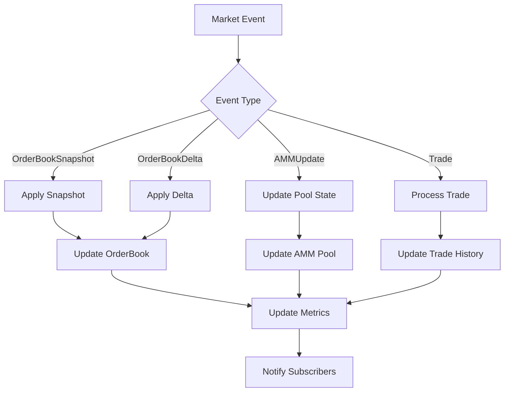
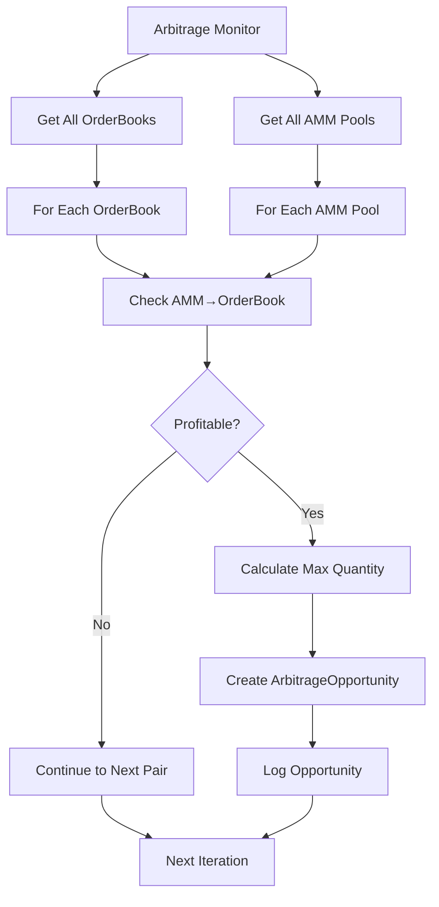

# Developer Guide - Quant Trading System

## Overview

This document provides a comprehensive guide for new developers joining the Quant Trading System project. It explains the core architecture, key data structures, and program flow to help you understand how the system operates.

## System Architecture

The Quant Trading System is a high-performance quantitative trading platform designed for real-time market data processing, order book management, AMM pool integration, and arbitrage detection.

### Core Components



## Key Data Structures

### 1. MarketDataManager

**Location**: `src/domain/market_data.rs`

The central component that manages all market data state including order books and AMM pools.

```rust
pub struct MarketDataManager {
    order_books: DashMap<Symbol, ThreadSafeOrderBook>,
    amm_pools: DashMap<PoolAddress, ThreadSafeAMMPool>,
    metrics: Arc<RwLock<SystemMetrics>>,
}
```

**Key Responsibilities**:
- Maintains thread-safe collections of order books and AMM pools
- Processes incoming market events
- Provides read access to market data for other components
- Collects and maintains system metrics

**Important Methods**:
- `process_event()`: Processes incoming market events
- `get_orderbook()`: Retrieves order book by symbol
- `get_amm_pool()`: Retrieves AMM pool by address
- `get_metrics()`: Returns current system metrics

### 2. ThreadSafeOrderBook

**Location**: `src/domain/order_book.rs`

Thread-safe wrapper around order book data structure with bid/ask levels.

```rust
pub struct ThreadSafeOrderBook {
    inner: Arc<RwLock<OrderBook>>,
}

pub struct OrderBook {
    symbol: Symbol,
    sequence: SequenceNumber,
    bids: BTreeMap<Price, Quantity>,
    asks: BTreeMap<Price, Quantity>,
    last_update: Timestamp,
}
```

**Key Features**:
- Maintains sorted bid/ask levels using BTreeMap
- Supports snapshot and delta updates
- Provides best bid/ask price queries
- Thread-safe operations with RwLock

### 3. ThreadSafeAMMPool

**Location**: `src/domain/amm_pool.rs`

Represents Automated Market Maker pools (Uniswap V2/V3 style) with liquidity reserves.

```rust
pub struct ThreadSafeAMMPool {
    inner: Arc<RwLock<AMMPool>>,
}

pub struct AMMPool {
    address: PoolAddress,
    pool_type: AMMPoolType,
    reserves: TokenReserves,
    sqrt_price: Option<SqrtPriceX96>,
    fee_tier: FeeTier,
    last_update: Timestamp,
}
```

**Key Features**:
- Supports both V2 (constant product) and V3 (concentrated liquidity) pools
- Calculates implied mid prices from reserves or sqrt price
- Provides price impact calculations
- Thread-safe state updates

### 4. ArbitrageDetector

**Location**: `src/domain/arbitrage.rs`

Detects arbitrage opportunities between order books and AMM pools.

```rust
pub struct ArbitrageDetector {
    min_profit_bps: u32,
    max_slippage_bps: u32,
    min_trade_size: Decimal,
}

pub struct ArbitrageOpportunity {
    pub buy_venue: Venue,
    pub sell_venue: Venue,
    pub buy_price: Price,
    pub sell_price: Price,
    pub max_quantity: Quantity,
    pub profit_percent: Decimal,
    pub estimated_profit: Decimal,
}
```

**Key Features**:
- Configurable minimum profit thresholds
- Checks both directions (AMM→OrderBook and OrderBook→AMM)
- Calculates maximum tradeable quantities
- Considers price impact and slippage

### 5. StreamIngester

**Location**: `src/infrastructure/ingestion/stream_ingester.rs`

Processes incoming market events from various data sources.

```rust
pub struct StreamIngester {
    receiver: mpsc::Receiver<MarketEvent>,
    manager: Arc<MarketDataManager>,
    buffer_size: usize,
}
```

**Key Features**:
- Asynchronous event processing
- Backpressure handling with configurable buffer sizes
- Error handling and logging
- Performance metrics collection

## Program Flow

### Main Application Flow



### Event Processing Flow



### Arbitrage Detection Flow



## Key Concepts

### Market Events

The system processes several types of market events:

- **OrderBookSnapshot**: Complete order book state at a point in time
- **OrderBookDelta**: Incremental updates to order book levels
- **AMMUpdate**: Updates to AMM pool reserves and pricing
- **Trade**: Executed trade information

### Thread Safety

All core data structures use thread-safe patterns:
- `Arc<RwLock<T>>` for shared mutable state
- `DashMap` for concurrent hash maps
- MPSC channels for inter-task communication

### Pricing Models

- **Order Books**: Best bid/ask pricing with depth information
- **AMM Pools**: Implied pricing from token reserves or sqrt price (Uniswap V3)
- **Arbitrage**: Price differential analysis between venues

## Getting Started

### Running the System

```bash
# Run the main application
cargo run

# Run with logging
RUST_LOG=info cargo run

# Run tests
cargo test

# Generate documentation
cargo doc --open
```

### Key Files to Understand

1. **`src/main.rs`**: Application entry point and orchestration
2. **`src/domain/market_data.rs`**: Central data management
3. **`src/domain/order_book.rs`**: Order book implementation
4. **`src/domain/amm_pool.rs`**: AMM pool implementation
5. **`src/domain/arbitrage.rs`**: Arbitrage detection logic
6. **`src/infrastructure/ingestion/`**: Data ingestion components

### Configuration

- Market data files: `data/` directory
- Logging configuration: `src/utils/logger.rs`
- API endpoints: Port 3030 (configurable)

## API Endpoints

The system exposes a REST API for monitoring:

- **GET /metrics**: System performance metrics
- **GET /orderbooks**: Current order book states
- **GET /pools**: AMM pool information

## Performance Considerations

- Lock-free data structures where possible
- Efficient memory management with Arc/Rc
- Asynchronous processing for I/O operations
- Configurable buffer sizes for backpressure handling

## Testing

The system includes comprehensive tests:
- Unit tests for individual components
- Integration tests for full system workflows
- Benchmark tests for performance validation

Run tests with:
```bash
make test
make bench
```

## Contributing

Before making changes:
1. Run `make lint-fix` to fix formatting issues
2. Run `make pre-push` to validate all checks pass
3. Ensure all tests pass
4. Update documentation as needed

This system is designed for high-performance, low-latency trading operations. Understanding the thread-safe patterns and event-driven architecture is crucial for effective development.
